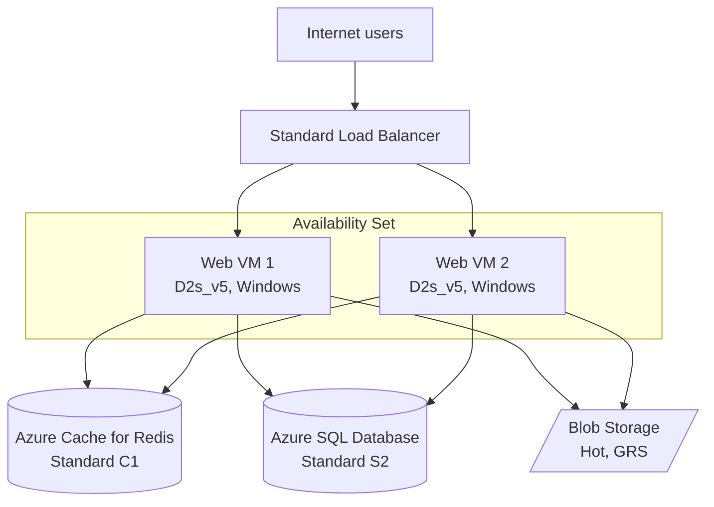

# Architecture Summary and Assumptions

This estimate prices a classic three-tier web application in the **West Europe** (Netherlands) region, billed in USD. Every cost in the workbook follows from the choices documented here, so if a number looks off, check this file first.

## The architecture

Two web servers sit behind a Standard Load Balancer in an availability set, which protects against single-host failures without the cost of zone-redundant duplicates. Sessions and hot lookups go to Redis. Relational data lives in a single Azure SQL database, and static assets plus backups land in a blob container.

## Why these SKUs

**Compute: Standard_D2s_v5 (2 vCPU, 8 GiB).** I compared B-series against D-series for the web tier. B2ms is cheaper on paper but burstable VMs bank credits and throttle under sustained load, which is exactly the wrong behaviour for a server taking constant traffic all day. D2s_v5 gives full-performance cores at a price that's still modest. Windows Server was chosen as the OS deliberately: it makes the Azure Hybrid Benefit scenario in the optimization analysis meaningful rather than theoretical.

**Database: Standard S2, DTU model (50 DTU, 250 GB included).** The DTU model won over vCore here for two reasons. A small web app doesn't need independent compute/storage scaling, and S2 bundles 250 GB of storage into one flat hourly rate, which keeps the bill predictable. The vCore model becomes the better call once you need more than ~100 DTU of headroom or want to apply Hybrid Benefit to SQL licensing; that trade-off is covered in the optimization doc.

**Cache: Azure Cache for Redis, Standard C1 (1 GiB).** Standard rather than Basic because Basic is a single node with no SLA. Session state on a cache with no replica is a self-inflicted outage waiting for a host reboot.

**Storage: GPv2, Hot tier, GRS.** The baseline uses geo-redundant storage so the estimate reflects a conservative, compliance-friendly default. Whether that's worth double the LRS rate is one of the what-if scenarios.

**Networking.** A Standard Load Balancer (five rules included in the base rate) fronts the web tier. Outbound traffic to the internet is the assignment's stated 1 TB/month, of which Azure gives the first 100 GB free.

### Compute Option: Azure Spot VMs
Azure Spot Virtual Machines allow organizations to purchase unused Azure compute capacity at significant discounts (often up to 90% off standard Pay-As-You-Go rates).
*   **The Evictability Rationale**: Spot VMs carry no SLA. If Microsoft requires the compute capacity back for a standard paying customer, the Spot VM will be evicted and shut down with a brief 30-second warning.
*   **Application Suitability**:
    - **Unsuitable Workloads**: Spot VMs are **completely unsuitable** for the primary web servers or database layers in our three-tier application. Because these servers handle user traffic and maintain active SQL sessions, sudden evictions would cause immediate application outages for users.
    - **Suitable Workloads**: Spot VMs are best used for non-critical, interruptible, or batch-processing parts of the architecture. For example, if the application has a background queue for image processing, scheduled data transformation (ETL) tasks, or nightly report generation, these nodes can run as Spot VMs. If evicted, the workload simply pauses until a new Spot node is provisioned, without impacting customer-facing web traffic.

---

## Usage assumptions

| Parameter | Value | Rationale |
|---|---|---|
| Region | West Europe | EU data residency; cost compared against East US in the workbook |
| Billing month | 730 hours | Azure Pricing Calculator convention |
| VM uptime | 24/7, both VMs | Production web tier, no auto-shutdown |
| Outbound internet traffic | 1 TB (1,024 GB)/month | Set by the assignment brief |
| Load balancer data processed | ~1.5 TB/month | Outbound responses plus inbound requests |
| Blob capacity | 1 TB Hot tier | Static assets and nightly DB exports |
| OS disks | 2 x P10 Premium SSD (128 GiB) | Premium SSD for consistent boot-volume latency |

## What the estimate leaves out

Blob transaction charges (under $2/month at these volumes), Azure Monitor and Log Analytics ingestion, backup storage beyond the SQL-included allowance, public IP addresses (~$3.65/month each), and any support plan. None of these move the total by more than a few percent, but a production budget should include them.

## A note on the prices

Unit prices were captured on 11 June 2026 from Azure's published list pricing (cross-checked against cloudprice.net, cloudpricecheck.com, and vantage.sh). Azure list prices drift, and calculator output also varies with currency and agreement type. Re-validate against the [Azure Pricing Calculator](https://azure.microsoft.com/pricing/calculator/) before treating any figure as current. Sources for each unit price sit in column D of the Assumptions sheet in the workbook.
