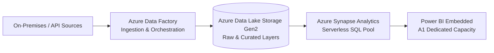

# Data Analytics Stack Architecture & Cost Estimate

This document defines a secondary architecture example—a modern **Cloud Data Analytics Stack** deployed in the **West Europe** region. It showcases how Azure pricing models apply to serverless, transaction-heavy, and capacity-based workloads.

---

## 1. The Architecture

### Workflow Description
1. **Ingest & Orchestrate**: Azure Data Factory (ADF) orchestrates pipelines to extract raw data from external APIs and copy it into the data lake.
2. **Store (Data Lake)**: Data is stored in Azure Data Lake Storage Gen2 (ADLS Gen2) using hierarchical namespaces and organized into standard medallion layers (Raw/Bronze and Curated/Gold).
3. **Query & Transform**: Azure Synapse Serverless SQL Pools query the files (Parquet/JSON) in the data lake on-demand using standard T-SQL, without maintaining running servers.
4. **Visualize**: Power BI Embedded hosts dashboards for users, backed by dedicated compute resource capacity.

---

## 2. SKU Selection & Justifications

*   **Azure Data Factory**: Billed per pipeline run activity. Ideal for scheduled ETL cycles because you only pay for execution seconds rather than keeping VMs running.
*   **ADLS Gen2 (Hot LRS)**: Locally Redundant Storage (LRS) is selected for cost optimization. Data in the lake can be regenerated from source APIs if a regional catastrophe occurs. Hot tier is preferred as data is frequently written/read during daily pipelines.
*   **Azure Synapse Serverless SQL**: Billed strictly by the volume of data scanned ($5.00 per TB). This completely eliminates idle database server costs, which is highly efficient for staging and analytics.
*   **Power BI Embedded (A1 SKU - 1 Node)**: Billed hourly at $1.008/hour. A1 SKU provides dedicated capacity for embedding reports into custom portals without requiring expensive per-user licensing for external consumers.

---

## 3. Baseline Cost Estimation

### Monthly Volume Assumptions:
- **ADF**: 50 pipeline executions per day (1,500 runs/month), average 3 activities per run.
- **ADLS Gen2**: 500 GB active data storage, Hot tier, LRS.
- **Synapse Serverless**: 2 TB of data scanned per month during daily transformations and dashboard queries.
- **Power BI Embedded**: Running 24/7 (730 hours/month) for continuous dashboard availability.

### Cost Breakdown (PAYG Baseline)

| Service | Component Details | Monthly Cost (USD) | Cost Model |
| :--- | :--- | :---: | :--- |
| **Azure Data Factory** | 1,500 pipeline runs + 4,500 activity executions | **$15.00** | Consumption (per activity/hour) |
| **ADLS Gen2** | 500 GB Storage ($10.40) + 1.2M transactions ($4.60) | **$15.00** | Hybrid (Capacity + Transaction) |
| **Azure Synapse** | 2 TB data processed @ $5.00/TB | **$10.00** | Serverless Consumption |
| **Power BI Embedded** | A1 Capacity (1 Node, 730 hours @ $1.008/hr) | **$735.84** | Hourly Capacity |
| **Total Baseline** | **Modern Data Analytics Stack** | **$775.84** | |

---

## 4. Cost Optimization Strategy (Saving 65.5%)

While ADF, ADLS, and Synapse are naturally optimized due to their consumption-based pricing, the capacity-based **Power BI Dedicated A1 Capacity** is a major cost driver, representing **94.8%** of the entire stack's baseline cost.

### Optimization Levers:

#### 1. Power BI Auto-Pause Scheduler (Saving $514.08/month)
For non-critical data environments, business users only access dashboards during core work hours. We can automate pausing the Power BI A1 capacity during nights and weekends:
- **Active Hours**: 10 hours/day (8:00 AM - 6:00 PM), Monday to Friday (22 business days/month).
- **Monthly Uptime**: 220 hours instead of 730 hours.
- **New Cost**: 220 hours * $1.008 = **$221.76/month** (Savings of **70%** on this resource).

#### 2. Synapse Query Cache Optimization (Saving $2.50/month)
Using T-SQL Views that utilize caching or partitioning parquet files by date prevents Synapse from scanning the entire data lake on every query, reducing the monthly scanned data from 2 TB to 1.5 TB.

### Optimized Cost Summary

| Service | Baseline Cost | Optimized Cost | Monthly Saving |
| :--- | :---: | :---: | :---: |
| Azure Data Factory | $15.00 | $15.00 | $0.00 (0%) |
| ADLS Gen2 | $15.00 | $15.00 | $0.00 (0%) |
| Azure Synapse | $10.00 | $7.50 | $2.50 (25%) |
| Power BI Embedded | $735.84 | $221.76 | $514.08 (70%) |
| **Total Stack** | **$775.84** | **$259.26** | **$516.58 (66.6%)** |
